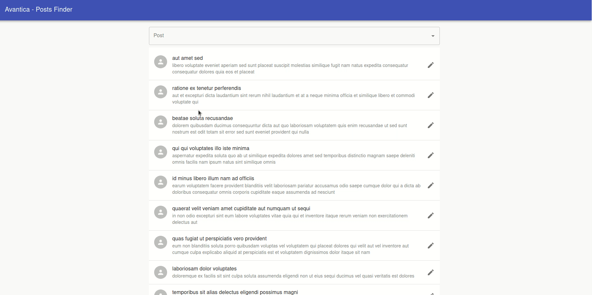

# React Posts Finder

This react app is designed for 18F take-home tests.
The app uses APIs from http://jsonplaceholder.typicode.com/ to populate the UI. Search functionality is to filter the posts fetched from API.
Autocomplete is enabled for the search input using the datalist technique. Furthermore, pagination is enabled on the site to improve the visibility
of all the posts fetched from the API. The site has the following features:

- Autocomplete for Posts
- View the individual Article 
- Editing of body and title of posts
- Pagination
- Responsive Design

## Contains

-   [x] [Material-UI](https://github.com/mui-org/material-ui)
-   [x] [Typescript](https://www.typescriptlang.org/)
-   [x] [React](https://facebook.github.io/react/)
-   [x] [Redux](https://github.com/reactjs/redux)
-   [x] [Redux-Saga](https://github.com/redux-saga/redux-saga)
-   [x] [Redux-Persist](https://github.com/rt2zz/redux-persist)
-   [x] [React Router](https://github.com/ReactTraining/react-router)
-   [x] [ExpressJS](https://github.com/expressjs/express)
-   [x] [NextJs](https://github.com/vercel/next.js)
-   [x] [Jest](https://github.com/facebook/jest)

### INSTALL

<pre>
<code>
cd post-finder
npm install
</code>
</pre>

### DEV MODE

<pre>
<code>
#run app 
cd post-finder
npm run dev
</code>
</pre>

### RUN TEST

<pre>
<code>
#run test
cd post-finder
npm test

#run test on CI
npm test:ci

#run test on Coverage
npm test:cov
</code>
</pre>

### PROD MODE
<pre>
<code>
#run app 
cd post-finder
npm start

</code>
</pre>

### Coverage

## Deployment
Just push the latest code to master and the site will be deployed on AWS

http://avantica-1704069303.us-east-1.elb.amazonaws.com

## Contributors
-   [Julián Porras](https://github.com/JulianPorras8)
